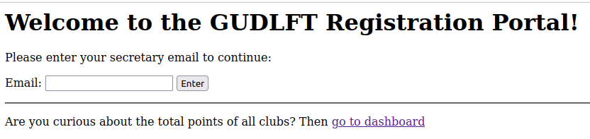
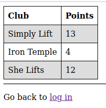
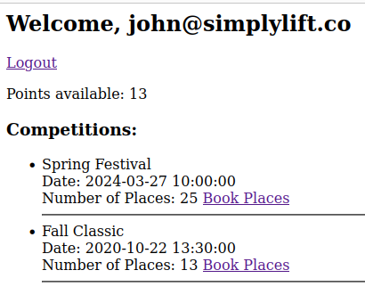
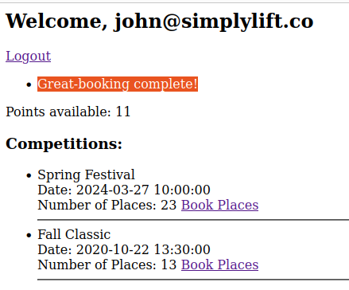
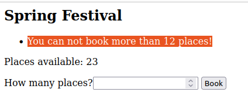
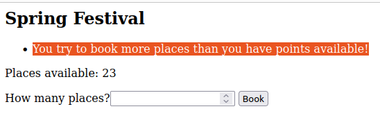
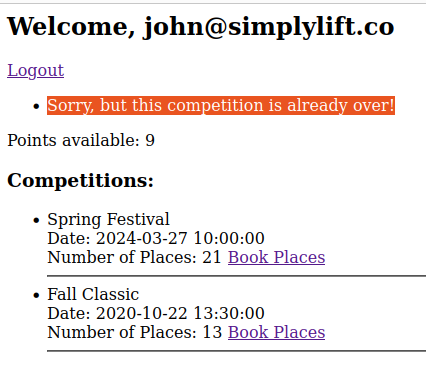

# Gudlft
## Description:
Project 11 OpenClassrooms Path  -  Gudlft  -- Improve a Python web application through testing and debugging

Güdlft is a company that has created a digital platform to coordinate strength competitions. 
Güdlft has set up a team called Regional Outreach to create a lighter (and cheaper) version of 
their current platform for regional organisers. The aim of the application is to streamline the 
management of competitions between clubs. 

The prototype is stored in this [GitHub repository](https://github.com/OpenClassrooms-Student-Center/Python_Testing).
In the issue section of this repository are bugs to fix and features to implement. The second step 
is to create functional and integration tests to make sure the functionality.

## Skills:
- Implement a Python test suite
- Handling errors and exceptions in Python
- Configure a Python environment
- Debug the code of a Python application

## Visualisation:
**1. Home Page**

 

**2. Dashboard**

 

**3. Show Summary**

 

**4. successful purchase of places**

 

**5. Error when purchase more than 12 places**

 

**6. Error when purchase more places than points available**

 

**7. Error when competition is over**

 
